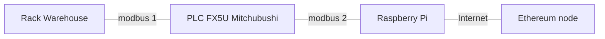
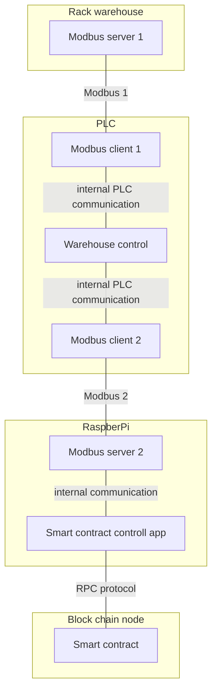

# Rack warehouse control with PLC and Blockchain

Devices that are used in this projects are: Rack warehouse, PLC FX5U from Mitsubishi, microcomputer Raspberry Pi, and computer with Ethereum blockchain node.

## Devices


### Rack warehouse

Rack warehouse is a standalone device which can be controlled using Modbus communication protocol. Detailed description is available at :

[Rack warehouse project](https://github.com/fsprojekti/rack-warehouse-jetmax)

### PLC Mitchubishi FX5U

PLK as a standard industrial controller is a central device that controls the movement of packages in a warehouse. 

### Raspberry Pi
Raspberry Pi device enables PLC to outsource stacking algorithm by providing communication to Ethereum node

### Ethereum node
Blockchain node device enables inclusion in distributed network of specific blockchain in this case Ethereum test network Rinkeby. Functionality of this device can be outsourced to external providers like Infura or Alchemy.

## Applications

Applications run on devices and provide functionalities to the system. 


### Rack warehouse - Modbus server
This application is part of [Rack warehouse project](https://github.com/fsprojekti/rack-warehouse-jetmax)

### PLC - Modbus client 1
This application connects Rack warehouse device with PLC. It is program that rund inside PLC programming environment (function blocks)

### PLC - Warehouse control

Warehouse control app is a program inside PLC programming environment that must handle warehousing functions:
* control warehouse package movement (control of transformational system (vehicles, robots, or and other system for physical package movements)
* monitor the state of a warehouse (which slots are occupied and which are free)
* enable stacking algorithm (Stacking algorithm is outsourced to blockchain)

### PLC - Modbus client 2
This application connects PLC with RaspberryPi via modbus protocol. 

### Raspberry Pi - Modbus server 2
This application enables communication with PLC via modbus protocol.
 
### Smart contract control app
This application translates messages that goes to or are returned from smart contract.

### Smart contract
Smart contract provides two functions *load()* and *unload()*
```js
/**
 * Function load accepts current state of the warehosue and calculates optimal slot for the package storage
 * 
 * @param stateWarehouse, current state of the warehouse
 * @returns {uint slot}, optimal slot for package 
 */
load(uint[] stateWarehouse)

/**
 * Function unload accepts current state of the warehosue and slot at which package for unloading is stored. Function returns next task for the warehouse. This function must be called until task for the wanted package unload in returned. Final task will have slotSource equal to input argument slot and slotTarget equal to unload slot index (usaly 1).
 * 
 * @param slot, package on this slot to be unloaded from the warehouse
 * @param stateWarehouse, current state of the warehouse
 * @returns {uint slotSource, uint slotTarget}
 */
unload(uint[] stateWarehouse, uint slot)
```

## Communication protocols - APIs

### API Modbus 1
API of this protocol is defined at https://github.com/fsprojekti/rack-warehouse-jetmax#modbus

### API Modbus 2
Modbus communicates via registers. 

|Register|Type|Read/Write|Name|Description|Instructions|
|---|---|---|---|---|---|
|100|coil|Write|load|begin calculation of load function of smart contract|
|101|coil|Write|unload|begin calculation of unload function of smart contract|
|102|coil|Read|load executed|the calculation of load function has ended and results in written in register 101|triggeres on rising edge 0->1
|103|coil|Read|unload executed|the calculation of unload function has ended and results in written in register 102,103|triggeres on rising edge 0->1
|100|register|Write|slots|Set current state slot occupation (masked 16bit integer)|slots variable is masked 16bit integer. Each bit represents one slot in a warehouse totaling to 16 slots
|101|register|Read|slot target|return value of load function|move package to this slot to load
|102|register|Read|slot source|return value of unload function|move package from this slot 
|103|register|Read|slot target|return value of unload function|move package to this slot

## Examples

### Load package to slot 7
