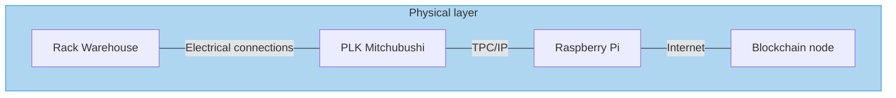
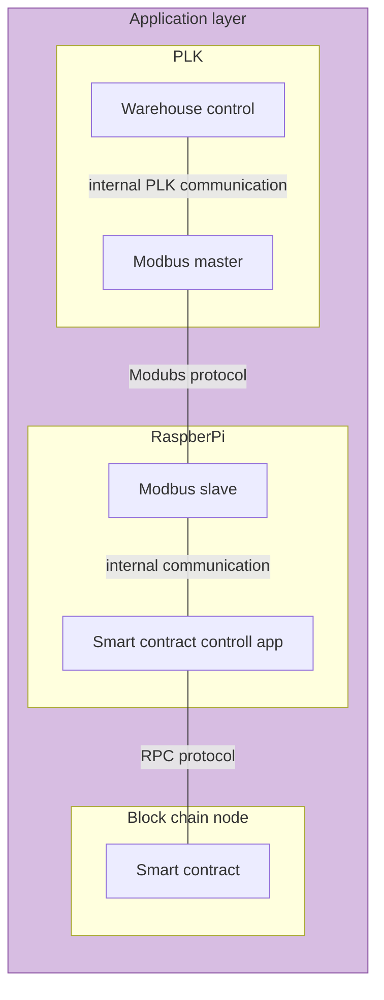

# plk-blockchain

System consist of physical layer and application layer.

## Physical layer

### Rack warehouse

[Warehouse project](https://github.com/fsprojekti/rack-warehouse-jetmax)

## Application layer

### Warehouse control
### Modbus master
### Modbus slave
### Smart contract control app
### Smart contract
