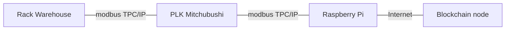
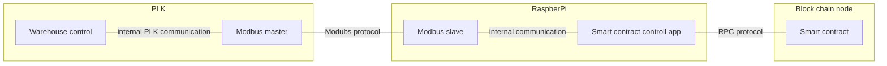

# plk-blockchain

Physical layer shows all devices that assembles the project.

## Physical layer

### Rack warehouse

Rack warehouse is a standalone device which can be controlled using modbus communication protocol. Detailed description is available at github repository: 

[Rack warehouse project](https://github.com/fsprojekti/rack-warehouse-jetmax)

### PLC Mitchubishi FX

PLK as a standard industrial controller is a central device that controls movement of packages in a warehouse. Its main functions are:
* control warehouse package movement (control of transformational system (vehicles, robots, or and other system for physical package movements)
* monitor the state of a warehouse (which slots are occupied and which are free)
* enable stacking algorithm (Stacking algorithm is outsourced to blockchain )

### Raspberry Pi
Raspberry pi device enables PLC to outsource stacking algorithm by providing communication to blockchain node

### Blockchain node
Blockchain node device enables inclusion in distributed network of specific blockchain in this case Ethereum test network Rinkeby. Functionality of this device can be outsourced to external provider like Infura or Alchemy.

## Application layer

### Warehouse control

Warehause control app is transmitig 

### Modbus master
### Modbus slave
### Smart contract control app
### Smart contract
