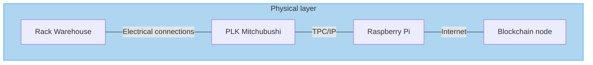
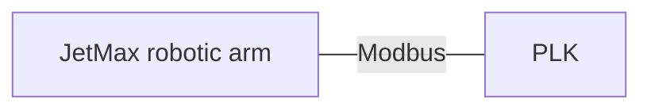
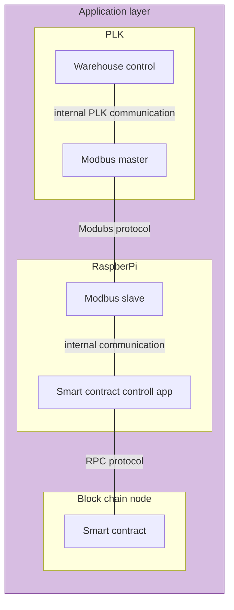

# plk-blockchain

System consist of physical layer and application layer.

## Physical layer

### Rack warehouse

Rack warehouse has 4 docs with capacity to stack 4 packages on top of each other. 

|||||
|---|---|---|---|
|slot 12|slot 13|slot 14|slot 15|
|slot 8|slot 9|slot 10|slot 11|
|slot 4|slot 5|slot 6|slot 7|
|slot 0|slot 1|slot 2|slot 3|

Modbus variables master side
|Register|Type|Read/Write|Name|Description|Instructions|
|---|---|---|---|---|---|
||register|Read|slots|Current state slot occupation (masked 16bit integer)|slots variable is masked 16bit integer. Each bit represents one slot in a warehouse totaling to 16 slots
||coil|Write|move_exec|Begin moving robot according to selected coordinates|triggers on rising edge (0->1)
||coil|Read|move_done|Robot stoped moving|triggers on rising edge(0->1)
||register|Write|slot_source|Source slot number from which package will be taken|values from 0 to 15
||register|Write|slot_target|Target slot number to which package will be put|values from 0 to 15

**slots** 

## Application layer

### Warehouse control
### Modubs master
### Modbus slave
### Smart contract control app
### Smart contract
